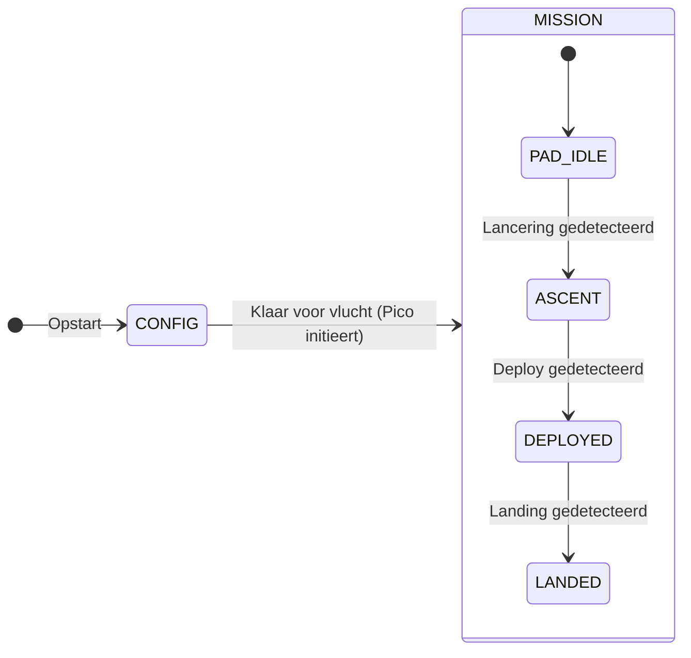

# Missie-states — overzicht

Dit document beschrijft **hoe we de vlucht in fases denken**: eerst opstellen en configureren, daarna energiezuinig wachten op de lancering, dan meten tot na de deploy, en tenslotte terugvinden na de landing. De namen zijn **Engels** (conventie in code en internationale wedstrijden zoals CanSat); hieronder staat steeds **wat het Nederlands betekent** en **waarom** we het zo doen.

---

## Waarom twee “lagen” van states?

We hebben **twee soorten computers** die samenwerken:

| Apparaat | Rol |
|----------|-----|
| **Raspberry Pi Zero 2 W** (“Zero”) | Sterke processor: camera, AprilTag, gimbal-servo’s, veel data en logica. |
| **Raspberry Pi Pico** (“Pico”) | Radio naar het grondstation: relatief eenvoudig protocol, moet stabiel blijven. |

Daarom splitsen we op in:

1. **Pico-modus (radio / sessie)** — weinig states, duidelijke commando’s voor de begeleiding.  
2. **Zero-substates (echte vluchtfase)** — fijnmazig: idle op de lanceerbaan, boost, deploy, geland, enz.

Zo raken we **niet in de war** tussen “we zitten in missiemodus op de radio” en “de raket is net vertrokken”.

---

## Laag 1 — Pico: `CONFIG` en `MISSION`

Deze modi bepalen vooral **wat de grondstation-begeleiding nog mag sturen** en hoe “druk” de radio-sessie is.

| Engelse naam | Nederlandse betekenis | Wat gebeurt er ongeveer? |
|--------------|------------------------|---------------------------|
| **`CONFIG`** | **Configuratie** (opstellen, testen, klaarzetten voor lancering) | Pico start hier typisch de radio-communicatie. Je mag commando’s sturen: frequentie instellen, sensoren uitlezen, later ook “start de missie”. **Hier** doen we o.a. IMU-calibratie (rustig laten werken) en **nul-luchtdruk op de Zero** vastleggen (referentie voor hoogte). |
| **`MISSION`** | **Missiemodus** (vluchtsoftware is actief; geen losse “CONFIG-sessie” meer) | De Zero draait de echte vluchtfases (zie laag 2). De Pico stuurt vooral **telemetrie** en luistert beperkt naar het grondstation — vergelijkbaar met het idee “we zijn bezig, niet alles onderbreken”. *(Vroeger heette dit in oefeningen soms `LAUNCH`; in de code heet het nu consequent `MISSION`.)* |

**Belangrijk:** `MISSION` betekent dus **niet** automatisch “de raket is al weg”. Het betekent: **we zijn vanaf nu in het scenario “vlucht”**; of je nog op de grond staat, bepaalt **laag 2**.

---

## Laag 2 — Zero: substates onder `MISSION`

Als de Pico in **`MISSION`** staat, kan de Zero intern in verschillende **substates** zitten. Onderstaande namen zijn **voorstellen** voor code en logbestanden; de tabel legt uit wat leerlingen moeten onthouden.

| Engelse substate | Nederlandse uitleg (voor de klas) | Sensoren (globaal) | Radio naar grond | Camera | Servo’s / gimbal |
|------------------|-----------------------------------|--------------------|------------------|--------|------------------|
| **`PAD_IDLE`** | **“Op het platform / in de raket, wachten”** — nog geen lancering gedetecteerd. | Vooral **BME280** (druk/temp) en **BNO055** (versnelling oriëntatie), **traag** (spaar energie). | **Geen** doorlopende uitzending naar het grondstation (spaar batterij). *Let op:* afstemmen met docenten of er in deze fase nog **korte luistervensters** nodig zijn voor veiligheid/commando’s. | **Uit** | **Uit** — servos naar een **veilige “ingeklapte” stand** (“**stowed**”) zodat niets beweegt in de raket. |
| **`ASCENT`** | **“Stijgfase”** — we hebben een **lancering** herkend (raket gaat omhoog of CanSat krijgt sterke versnelling / drukverandering). | Zelfde sensoren, maar **sneller loggen** om de curve goed te vangen. Eventueel **camera al aanzetten** als die nodig is om de **deploy** (uitschieten van de CanSat) te herkennen. | Meer data richting Pico om later te verzenden of te bufferen (afhankelijk van jullie ontwerp). | **Aan** indien nodig voor detectie | Nog **geen** actieve gimbal; servos blijven veilig tenzij jullie anders afspreken. |
| **`DEPLOYED`** | **“Uitgeschoten / vrij”** — de CanSat hangt of valt onder parachute; **missie metingen** lopen volop. | **Druk, hoogte-afgeleide, IMU, AprilTag** — alles wat jullie nodig hebben voor log en wedstrijd. | **Radio aan** — telemetrie naar grondstation. | **Aan** (film + tag-detectie) | **Servo’s aan**. Parameter **`gimbal_enable`**: als **aan** → **gimbal actief** (nivelleren); als **uit** (bv. drone-test) → servos naar een **vaste “missie-default”**-positie (niet dezelfde als ingeklapt op de pad) + **BNO055** blijft nuttig om **schudden/trillingen** te monitoren. |
| **`LANDED`** | **“Geland — zoeken”** — de CanSat ligt op de grond; we willen vooral **gevonden worden**. | Minimaal (alleen wat nodig is voor een **alive**-signaal of eenvoudige status). | **Zelden** een kort **“ik leef nog”**-signaal (lange interval), liefst met **richtantenne** op het grondstation. | **Uit** (spaar stroom) | **Uit** — veilig, geen onnodige beweging. |

**Geheugensteuntje voor benamingen ibn the English:**

- **PAD** = launch pad = **lanceerplatform**.  
- **IDLE** = **ruststand** / wachten — we doen net genoeg om te weten wanneer het “los” gaat.  
- **ASCENT** = **opstijgen**.  
- **DEPLOYED** = **uit de raket / missie echt bezig**.  
- **LANDED** = **geland**.

---

## Overgangen (wie gaat wanneer waar naartoe?)

In woorden (exacte drempels komen later bij sensor-tuning):

1. **Opstart** → alles in **`CONFIG`**: radio, kalibratie, nul-druk, checks.  
2. Als alles klaar is → Pico vraagt overgang naar **`MISSION`**; Zero start in **`PAD_IDLE`**.  
3. **Sensoren + algoritme** zien “lancering” → Zero naar **`ASCENT`**.  
4. **Camera / IMU / druk** zien “deploy” → Zero naar **`DEPLOYED`**.  
5. **Druk beweegt naar grondniveau** of combinatie-regels → Zero naar **`LANDED`**.

*(De precieze regels “lancering” en “deploy” schrijven we in een apart hoofdstuk zodra de sensorkeuzes vastliggen.)*

---

## Frequentie van de radio — niet vergeten na herstart

De **vluchtleiding** kan een andere frequentie geven. Dat kunnen we al instellen (`SET FREQ` in het protocol — zie base station README).

**Probleem:** na een **herstart** (stroom even weg, software crash, nieuwe SD) weet niemand meer welke frequentie we hadden.

**Oplossing:** de gekozen frequentie (en evt. node / sleutel) **opslaan** op:

- de **Zero** (bestand op de SD), en/of  
- de **Pico** (flash of klein bestand),

en **bij opstart** weer inlezen voordat je naar `MISSION` gaat. **Eén “bron van waarheid”** afspreken (Zero of Pico) voorkomt "ruzie" tussen twee opgeslagen waarden.

---

## WiFi op de Zero — kort

**Uitzetten** kan een beetje stroom besparen; de **grootste** winst is meestal: **camera uit**, **servo’s uit**, **weinig radio zenden**.  
**Let op:** als je alleen via **WiFi** op de Zero inlogt, kun je jezelf buitensluiten. Op de grond eerst testen met **USB-serial** of een andere manier om bij de Pi te komen.

---

## Link met bestaande code in deze repository

In `src/cansat_hw/radio/wire_protocol.py` staat `RadioRuntimeState` met **`CONFIG`** en **`MISSION`**. Draad-commando’s: `SET MODE MISSION` / `GET MODE` (antwoord `OK MODE MISSION`). Voor oude scripts en notities blijft **`SET MODE LAUNCH`** nog als **alias** werken; de CanSat antwoordt dan met **`OK MODE MISSION`** en zet intern dezelfde modus. In missiemodus weigert de Zero de meeste commando’s met **`ERR BUSY MISSION`**.

### MISSION-preflight (sanity check vóór `PAD_IDLE`)

`SET MODE MISSION` voert eerst een **preflight** uit. Alleen als alle checks slagen, zet de Zero de modus om en komt het systeem in `PAD_IDLE`. Anders krijgt het base station `ERR PRE …` met korte codes voor wat ontbreekt — de Zero **blijft in CONFIG**. Dezelfde check is los op te vragen met `PREFLIGHT`.

| Code | Wat wordt gecheckt | Hoe herstellen |
|------|---------------------|----------------|
| `TIME` | Systeemklok gezet sinds boot (`SET TIME`), óf NTP-sync, óf klok > 2025-01-01 | `!time` / `!timeepoch $(date +%s)` vanaf de Pico |
| `GND` | Grondreferentie-druk gezet (`ground_hpa`) | `!calground` (gemiddelde BME280) of `SET GROUND <hPa>` |
| `BME` | BME280 reageert en levert plausibele druk (800–1100 hPa) | I²C-bedrading / `bme280_test.py` |
| `IMU` | BNO055 aanwezig, calibratie **sys ≥ 1** | CanSat rustig laten liggen, kort bewegen |
| `DSK` | ≥ 500 MB vrij op `/` | Oude fotos opruimen |
| `LOG` | Fotomap bestaat en is schrijfbaar (service: `/home/icw/photos` — via `--photo-dir` + `ExecStartPre=mkdir -p`) | `mkdir -p /home/icw/photos` |
| `FRQ` | `SET FREQ` is gegeven deze sessie of **geladen uit** `config/radio_runtime.json` | `SET FREQ <mhz>` via Pico (zet én persisteert aan beide kanten) |
| `GIM` | `config/gimbal/servo_calibration.json` aanwezig | `scripts/gimbal/servo_calibration.py` |

`PREFLIGHT`-OK-antwoord bevat ook de **trigger-defaults** (`ASC`, `DEP`, `LND`) zodat het team ze kan bevestigen. Eenheden:

- **`ASC` = stijging in meters** (t.o.v. grondreferentie). Intern rekent de Zero dit via de ISA-formule om naar een drukdaling in hPa (≈ 8,3 m/hPa nabij zeeniveau). `GET TRIGGERS` toont het hPa-equivalent mee zodra `ground_hpa` bekend is, bv. `ASC=5.0m/0.60hPa`.
- **`DEP` = seconden** (deploy-duur na detectie).
- **`LND` = meters** (hoogte onder grond waar landing wordt aangenomen).

Defaults overschrijven: `SET TRIGGER ASCENT 5` (m), `SET TRIGGER DEPLOY 3.0` (s), `SET TRIGGER LAND 10` (m).

---

## Samenvatting voor op het bord

| Engels | Nederlands in één zin |
|--------|------------------------|
| `CONFIG` | Opstellen: commando’s, calibratie, nul-druk, frequentie. |
| `MISSION` | Vluchtsoftware actief; Zero volgt substates. |
| `PAD_IDLE` | Wachten in raket, traag meten, bijna alles uit. |
| `ASCENT` | Lancering gezien, sneller meten, evt. camera voor deploy. |
| `DEPLOYED` | Vrij in de lucht: loggen, radio, servo’s, optioneel gimbal. |
| `LANDED` | Op de grond: spaar energie, af en toe “alive”. |

---

[← Documentatie-index](README.md) · [← Project README](../README.md)
