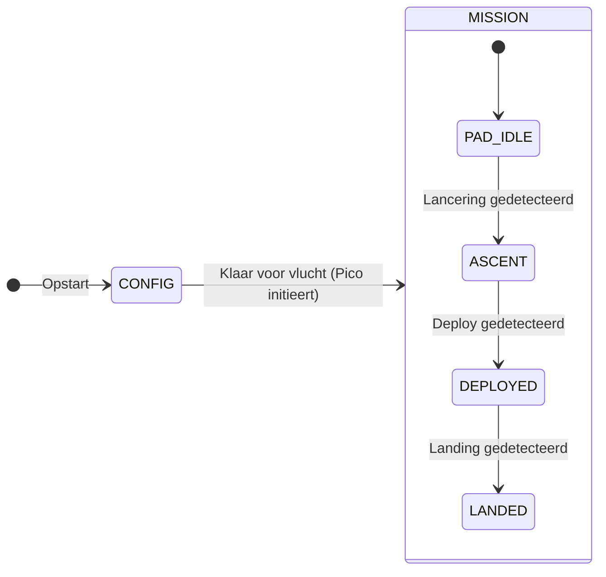

# Missie-states — overzicht

Dit document beschrijft **hoe we de vlucht in fases denken**: eerst opstellen en configureren, daarna energiezuinig wachten op de lancering, dan meten tot na de deploy, en tenslotte terugvinden na de landing. De namen zijn **Engels** (conventie in code en internationale wedstrijden zoals CanSat); hieronder staat steeds **wat het Nederlands betekent** en **waarom** we het zo doen.

> **Afkortingen** (eerste gebruik; volledige lijst in [glossary.md](glossary.md)):
> **CanSat** = flight-software op de Raspberry Pi Zero 2 W (de "Zero").
> **Pico** = base station (Raspberry Pi Pico, Thonny).
> **BME280** = luchtdruk-/temperatuursensor.
> **BNO055** = 9-DoF oriëntatie-/acceleratie-sensor (**IMU**).
> **TLM** = "telemetry"-frame: 60 B binair packet met mode, state,
> dt\_ms, alt, druk, temp, IMU-samples, peak-g, freefall-duur,
> trig-waarden — één per "tick".
> **EVT** = ongevraagd "event"-bericht (state-wissel, mode-wissel,
> servo-watchdog), gestuurd door de CanSat.
> **IIR** = Infinite-Impulse-Response filter op de BME280-chip die
> hoogte-ruis dempt.
> **OSP / OSR** = oversampling (datasheet-term) — meer samples = minder
> ruis per read, trager antwoord.
> **ISA** = International Standard Atmosphere — drukmodel voor de
> hoogte-omzetting.

---

## Waarom twee “lagen” van states?

We hebben **twee soorten computers** die samenwerken:

| Apparaat | Rol |
|----------|-----|
| **Raspberry Pi Zero 2 W** (“Zero”) | Sterke processor: camera, AprilTag, gimbal-servo’s, veel data en logica. |
| **Raspberry Pi Pico** (“Pico”) | Radio naar het grondstation: relatief eenvoudig protocol, moet stabiel blijven. |

Daarom splitsen we op in:

1. **Pico-modus (radio / sessie)** — weinig states, duidelijke commando’s voor de begeleiding.  
2. **Zero-substates (echte vluchtfase)** — fijnmazig: idle op de lanceerbaan, boost, deploy, geland, enz.

Zo raken we **niet in de war** tussen “we zitten in missiemodus op de radio” en “de raket is net vertrokken”.

---

## Laag 1 — Pico: `CONFIG`, `MISSION` en `TEST`

Deze modi bepalen vooral **wat de grondstation-begeleiding nog mag sturen** en hoe “druk” de radio-sessie is.

| Engelse naam | Nederlandse betekenis | Wat gebeurt er ongeveer? |
|--------------|------------------------|---------------------------|
| **`CONFIG`** | **Configuratie** (opstellen, testen, klaarzetten voor lancering) | Pico start hier typisch de radio-communicatie. Je mag commando’s sturen: frequentie instellen, sensoren uitlezen, later ook “start de missie”. **Hier** doen we o.a. IMU-calibratie (rustig laten werken) en **nul-luchtdruk op de Zero** vastleggen (referentie voor hoogte). |
| **`MISSION`** | **Missiemodus** (vluchtsoftware is actief; geen losse “CONFIG-sessie” meer) | De Zero draait de echte vluchtfases (zie laag 2). De Pico stuurt vooral **telemetrie** en luistert beperkt naar het grondstation — vergelijkbaar met het idee “we zijn bezig, niet alles onderbreken”. *(Vroeger heette dit in oefeningen soms `LAUNCH`; in de code heet het nu consequent `MISSION`.)* |
| **`TEST`** | **Test-modus** (DEPLOYED nabootsen met een timer i.p.v. triggers) | Een **dry-run** van de `DEPLOYED`-fase. De Zero voert DEPLOYED-taken uit, pusht telemetrie, en valt na een vaste **timer** (default 10 s, instelbaar 2..60 s) automatisch terug naar `CONFIG`. Handig om `DEPLOYED`-gedrag te bouwen en testen **zonder** echte trigger-drempels te moeten forceren. **Geen abort**: eenmaal gestart loopt de timer uit. |

**Belangrijk:** `MISSION` betekent dus **niet** automatisch “de raket is al weg”. Het betekent: **we zijn vanaf nu in het scenario “vlucht”**; of je nog op de grond staat, bepaalt **laag 2**.

### `TEST`-modus — dry-run van `DEPLOYED`

Stroom:

1. Base station stuurt `SET MODE TEST [seconds]` (default 10). Eerst gaat de Zero door een **minimale preflight**: `TIME`, `GND`, `BME` (geen `IMU`/`DSK`/`LOG`/`FRQ`/`GIM`). Ontbreekt er iets → `ERR PRE TIME GND BME` (wat van toepassing is) en de Zero blijft in `CONFIG`.
2. Slaagt de preflight → `OK MODE TEST <seconds>` en de Zero schakelt naar `TEST`.
3. Elke seconde pusht de Zero een **telemetrie-frame** naar het base station:
   `TLM <dt_ms> <alt_m> <p_hpa> <T_c> <heading> <roll> <pitch> <sys_cal>` (≤ 60 bytes). Ontbrekende sensoren leveren `NA` op de plaats van die waarde.
4. Tijdens `TEST` blokkeert de Zero alles behalve `PING`, `GET MODE`, `GET TIME` met `ERR BUSY TEST`. Ook `SET MODE CONFIG` en `STOP RADIO` worden geweigerd — bewust, zodat de dry-run representatief is en niet halverwege onderbroken wordt.
5. Na de timer stuurt de Zero ongevraagd **één** event naar het base station: `EVT MODE CONFIG END_TEST`, en herstelt intern naar `CONFIG`. De Pico-CLI detecteert dit event automatisch en valt terug op de prompt. `MODE_LAST` (voor de JSONL-log) wordt meteen bijgewerkt.

Base-station-kant (Pico): `!test [seconds]` doet bovenstaande in één beweging — stuur, luister, terug naar prompt. Met `!log on` actief eindigt elk TLM-frame (inclusief geparste velden) in het JSONL-bestand zodat je achteraf met pandas door de test kan scrollen.

**Phase 1 (nu in code)** dekt alleen telemetrie (BME280 + BNO055). Camera en gimbal komen in een latere fase erbij — het skelet blijft identiek.

---

## Laag 2 — Zero: substates onder `MISSION`

Als de Pico in **`MISSION`** staat, kan de Zero intern in verschillende **substates** zitten. Onderstaande namen zijn **voorstellen** voor code en logbestanden; de tabel legt uit wat leerlingen moeten onthouden.

| Engelse substate | Nederlandse uitleg (voor de klas) | Sensoren (globaal) | Radio naar grond | Camera | Servo’s / gimbal |
|------------------|-----------------------------------|--------------------|------------------|--------|------------------|
| **`PAD_IDLE`** | **“Op het platform / in de raket, wachten”** — nog geen lancering gedetecteerd. | Vooral **BME280** (druk/temp) en **BNO055** (versnelling oriëntatie), **traag** (spaar energie). | **Geen** doorlopende uitzending naar het grondstation (spaar batterij). *Let op:* afstemmen met docenten of er in deze fase nog **korte luistervensters** nodig zijn voor veiligheid/commando’s. | **Uit** | **Uit** — servos naar een **veilige “ingeklapte” stand** (“**stowed**”) zodat niets beweegt in de raket. |
| **`ASCENT`** | **“Stijgfase”** — we hebben een **lancering** herkend (raket gaat omhoog of CanSat krijgt sterke versnelling / drukverandering). | Zelfde sensoren, maar **sneller loggen** om de curve goed te vangen. Eventueel **camera al aanzetten** als die nodig is om de **deploy** (uitschieten van de CanSat) te herkennen. | Meer data richting Pico om later te verzenden of te bufferen (afhankelijk van jullie ontwerp). | **Aan** indien nodig voor detectie | Nog **geen** actieve gimbal; servos blijven veilig tenzij jullie anders afspreken. |
| **`DEPLOYED`** | **“Uitgeschoten / vrij”** — de CanSat hangt of valt onder parachute; **missie metingen** lopen volop. | **Druk, hoogte-afgeleide, IMU, AprilTag** — alles wat jullie nodig hebben voor log en wedstrijd. | **Radio aan** — telemetrie naar grondstation. | **Aan** (film + tag-detectie) | **Servo’s aan**. Parameter **`gimbal_enable`**: als **aan** → **gimbal actief** (nivelleren); als **uit** (bv. drone-test) → servos naar een **vaste “missie-default”**-positie (niet dezelfde als ingeklapt op de pad) + **BNO055** blijft nuttig om **schudden/trillingen** te monitoren. |
| **`LANDED`** | **“Geland — zoeken”** — de CanSat ligt op de grond; we willen vooral **gevonden worden**. | Minimaal (alleen wat nodig is voor een **alive**-signaal of eenvoudige status). | **Zelden** een kort **“ik leef nog”**-signaal (lange interval), liefst met **richtantenne** op het grondstation. | **Uit** (spaar stroom) | **Uit** — veilig, geen onnodige beweging. |

**Geheugensteuntje voor benamingen ibn the English:**

- **PAD** = launch pad = **lanceerplatform**.  
- **IDLE** = **ruststand** / wachten — we doen net genoeg om te weten wanneer het “los” gaat.  
- **ASCENT** = **opstijgen**.  
- **DEPLOYED** = **uit de raket / missie echt bezig**.  
- **LANDED** = **geland**.

---

## Overgangen (wie gaat wanneer waar naartoe?)

In woorden (exacte drempels komen later bij sensor-tuning):



1. **Opstart** → alles in **`CONFIG`**: radio, kalibratie, nul-druk, checks.  
2. Als alles klaar is → Pico vraagt overgang naar **`MISSION`**; Zero start in **`PAD_IDLE`**.  
3. **Sensoren + algoritme** zien “lancering” → Zero naar **`ASCENT`**.  
4. **Camera / IMU / druk** zien “deploy” → Zero naar **`DEPLOYED`**.  
5. **Druk beweegt naar grondniveau** of combinatie-regels → Zero naar **`LANDED`**.

*(De precieze regels “lancering” en “deploy” schrijven we in een apart hoofdstuk zodra de sensorkeuzes vastliggen.)*

---

## Frequentie van de radio — niet vergeten na herstart

De **vluchtleiding** kan een andere frequentie geven. Dat kunnen we al instellen (`SET FREQ` in het protocol — zie base station README).

**Probleem:** na een **herstart** (stroom even weg, software crash, nieuwe SD) weet niemand meer welke frequentie we hadden.

**Oplossing:** de gekozen frequentie (en evt. node / sleutel) **opslaan** op:

- de **Zero** (bestand op de SD), en/of  
- de **Pico** (flash of klein bestand),

en **bij opstart** weer inlezen voordat je naar `MISSION` gaat. **Eén “bron van waarheid”** afspreken (Zero of Pico) voorkomt "ruzie" tussen twee opgeslagen waarden.

---

## WiFi op de Zero — kort

**Uitzetten** kan een beetje stroom besparen; de **grootste** winst is meestal: **camera uit**, **servo’s uit**, **weinig radio zenden**.  
**Let op:** als je alleen via **WiFi** op de Zero inlogt, kun je jezelf buitensluiten. Op de grond eerst testen met **USB-serial** of een andere manier om bij de Pi te komen.

---

## Link met bestaande code in deze repository

In `src/cansat_hw/radio/wire_protocol.py` staat `RadioRuntimeState` met **`CONFIG`**, **`MISSION`** en **`TEST`**. Draad-commando’s: `SET MODE MISSION` / `GET MODE` (antwoord `OK MODE MISSION`). Voor oude scripts en notities blijft **`SET MODE LAUNCH`** nog als **alias** werken; de CanSat antwoordt dan met **`OK MODE MISSION`** en zet intern dezelfde modus. In missiemodus weigert de Zero de meeste commando’s met **`ERR BUSY MISSION`**, in testmodus met **`ERR BUSY TEST`**. `SET MODE TEST [seconds]` start de dry-run (zie boven); `GET MODE` in testmodus antwoordt met `OK MODE TEST <seconds>`.

### MISSION-preflight (sanity check vóór `PAD_IDLE`)

`SET MODE MISSION` voert eerst een **preflight** uit. Alleen als alle checks slagen, zet de Zero de modus om en komt het systeem in `PAD_IDLE`. Anders krijgt het base station `ERR PRE …` met korte codes voor wat ontbreekt — de Zero **blijft in CONFIG**. Dezelfde check is los op te vragen met `PREFLIGHT`.

| Code | Wat wordt gecheckt | Hoe herstellen |
|------|---------------------|----------------|
| `TIME` | Systeemklok gezet sinds boot (`SET TIME`), óf NTP-sync, óf klok > 2025-01-01 | `!time` / `!timeepoch $(date +%s)` vanaf de Pico |
| `GND` | Grondreferentie-druk gezet (`ground_hpa`) | `!calground` (gemiddelde BME280) of `SET GROUND <hPa>` |
| `BME` | BME280 reageert en levert plausibele druk (800–1100 hPa) | I²C-bedrading / `bme280_test.py` |
| `IMU` | BNO055 aanwezig, calibratie **sys ≥ 1** | CanSat rustig laten liggen, kort bewegen |
| `DSK` | ≥ 500 MB vrij op `/` | Oude fotos opruimen |
| `LOG` | Fotomap bestaat en is schrijfbaar (service: `/home/icw/photos` — via `--photo-dir` + `ExecStartPre=mkdir -p`) | `mkdir -p /home/icw/photos` |
| `FRQ` | `SET FREQ` is gegeven deze sessie of **geladen uit** `config/radio_runtime.json` | `SET FREQ <mhz>` via Pico (zet én persisteert aan beide kanten) |
| `GIM` | `config/gimbal/servo_calibration.json` aanwezig | `scripts/gimbal/servo_calibration.py` |

`PREFLIGHT`-OK-antwoord bevat ook de **trigger-defaults** (`ASC`, `DEP`, `LND`) zodat het team ze kan bevestigen. Korte versie: `ASC` in **meters stijging**, `DEP` in **seconden**, `LND` in **meters** boven grond. `GET TRIGGERS` toont zodra grond gekend is ook het hPa-equivalent van `ASC`, bv. `ASC=5.0m/0.60hPa`.

Volledige uitleg per trigger (gebeurtenis, sensor, tuning-tips, instelcommando's): **[Mission triggers](mission_triggers.md)**.

### BME280 IIR-filter per mode (responsief vs. stil)

De BME280 draait in **forced mode**: het filter verwerkt alleen samples die we **expliciet** lezen. Een hoge IIR-coëfficient (×16) dempt ruis tot ~0.3 Pa RMS (~2 cm), maar heeft **10–12 s** nodig om 99 % van een echte hoogteverandering te bereiken — dat voelt traag bij een handmatig `!alt` in `CONFIG`.

Daarom wisselt de Zero de filter-coëfficient automatisch mee met de mode:

| Mode | Default IIR | Instelbaar via |
|------|-------------|----------------|
| `CONFIG` | 4 (snelle step-response; `!alt` reageert binnen ~1 s) | `--bme280-iir` bij opstart, of `SET IIR <0|2|4|8|16>` tijdens CONFIG |
| `TEST` / `MISSION` | 16 (stil signaal voor apogee- en deploy-detectie) | `--bme280-iir-mission` bij opstart |

- `SET MODE TEST` / `SET MODE MISSION` → chip wordt op `MIS`-preset gezet (default 16).
- `EVT MODE CONFIG END_TEST` en `SET MODE CONFIG` → chip wordt teruggerold naar `CFG`-preset (default 4).
- `SET IIR` wordt geweigerd buiten `CONFIG` (`ERR BUSY` / `ERR BUSY TEST|MISSION`) zodat de missie nooit ongemerkt een trage filter krijgt tijdens een kritieke fase.
- `GET IIR` mag altijd en toont zowel de huidige chip-waarde als beide presets.

### Continuous sensor-sampler (Fase 7)

De main-loop van `cansat_radio_protocol.py` roept bij **elke iteratie**
een gedeelde [`SensorSampler`](../src/cansat_hw/sensors/sampler.py).tick()
aan. Dat is **één BME280-read + één BNO055-read** per tick, met
rolling-window statistieken:

| Afgeleid veld | Definitie | Gebruikt in |
|---|---|---|
| `peak_accel_g` | Max `‖a_lin‖` in het laatste ~500 ms window | `ACC`, `SHOCK`, `IMPACT` triggers |
| `freefall_for_s` | Aaneensluitende secondes met `‖a_lin‖ ≤ 0,3 g` | `FREEFALL` trigger |
| `alt_stable_for_s` | Aaneensluitende secondes met hoogte binnen σ-band | `STABLE` trigger |
| `alt_m` | Laatste BME280-hoogte (mode-aware IIR) | Alle altitude-triggers |

**Tick-cadans** hangt af van de main-loop receive-timeout:

| Mode | Tick-cadans | Waarom |
|---|---|---|
| `CONFIG` | ≈1 Hz (`--poll`, default 1.0 s) | Spaar CPU; operator-commando's dicteren het tempo. |
| `MISSION` / `TEST` | ≈5 Hz (rx\_timeout 0.2 s) | Snelle IMU-respons tijdens motor-burn / parachute-snap / impact. |

Deze 5 Hz-tick is óók de motor achter de **autonome state-advance**
(zie hieronder).

### TLM-cadans (binary frames)

`build_telemetry_packet()` bouwt een 60 B binair frame; de main-loop
pusht het **ongevraagd** naar het base station zodra `MISSION` of
`TEST` actief is.

| Mode | TLM-push-interval | Configureerbaar? |
|---|---|---|
| `CONFIG` | **geen** autonome TLM — alleen op-verzoek via `GET ALT`, `READ BME280`, `READ BNO055` enz. | n.v.t. |
| `MISSION` | **1.0 s** (default, instelbaar via `--mission-tlm-interval ≥ 0.1`) | ja, op start van de Zero-service |
| `TEST` | **1.0 s** (vast) | nee — bewust niet, dry-run moet reproduceerbaar zijn |

> De TLM-push-cadans (1 Hz) is **losgekoppeld** van de sensor-tick
> (5 Hz). Je ziet per seconde één frame op de radio, maar de
> state-machine evalueert intern 5× zo vaak — dus korte IMU-pieken
> tussen twee TLM-pushes worden niet gemist.

### Autonome state-advance

`PAD_IDLE → ASCENT → DEPLOYED → LANDED` gebeurt **zonder** Pico-commando.
Bij elke sampler-tick (dus ≈5 Hz in MISSION) roept de main-loop:

```text
sampler.tick()
maybe_advance_flight_state(state, sampler.snapshot)
_emit_evt_state_if_changed()
_apply_servo_policy()
```

Gevolgen op het base station:

- `EVT STATE <NAME> <REASON>` verschijnt ongevraagd bij elke transitie
  (bv. `EVT STATE ASCENT ACC`). Zie
  [mission_triggers.md §Reason-codes](mission_triggers.md#reason-codes-in-detail)
  voor alle mogelijke waarden.
- Binnen het binary TLM-frame staan `mode` en `flight_state` altijd mee,
  dus ook zonder EVT reconstrueer je elke transitie uit de logs.
- `GET STATE` → `OK STATE <NAME> [<REASON>]` geeft de huidige state +
  de reden van de laatste transitie (leeg bij boot of na een
  handmatige `SET STATE …`).
- De Pico-CLI parseert `OK STATE …` en `EVT STATE …` automatisch en
  werkt z'n lokale prompt-label bij. In `!log`-JSONL verschijnen ze als
  `{"kind": "STATE", "state": "ASCENT", "reason": "ACC"}`.

**Mission-overgangs-side-effects** (voor de volledigheid):

- `SET MODE MISSION` → apogee wordt **automatisch gereset** (je hoeft
  geen `!resetapogee` meer vooraf te doen). Preflight moet eerst OK zijn.
- `SET MODE TEST` → flight\_state springt direct naar `DEPLOYED` (vast),
  sampler-tick en TLM lopen op 1 Hz, geen echte triggers.
- `SET MODE CONFIG` of `EVT MODE CONFIG END_TEST` → flight\_state terug
  naar `NONE`, rail autonoom uitgezet (zie rail-policy hieronder).

### Servo-rail-policy per flight-state

De [state-policy](../src/cansat_hw/servos/state_policy.py) helper mapt
`(prev_mode, prev_state) → (new_mode, new_state)` op een
`ServoAction`. De main-loop past de actie bij elke tick toe (zowel
bij `(mode,state)`-wissels door preflight als bij autonome
state-advance). Samengevat:

| Flight-state | Servo-rail | Gedrag |
|---|---|---|
| `NONE` (CONFIG) | **uit tenzij operator** `SERVO ENABLE/HOME/...` geeft | Alleen handmatige controle; watchdog kapt tuning na 5 min. |
| `PAD_IDLE` | **uit** | Raket staat op de pad; servo's mechanisch in stow vóór MISSION. |
| `ASCENT` | **uit** | Motor-burn; gimbal niet actief. |
| `DEPLOYED` | **aan** | Gimbal-loop (Fase 9) zal hier positie-aansturing overnemen. |
| `LANDED` | **stow → uit** (via PARK-sequence) | Beveilig mechaniek, zet rail af voor zoek-fase. |
| `DEPLOYED` (TEST) | **aan** | Dry-run pusht TLM, rail aan zodat je de gimbal in de lucht kunt testen. |

Bij service-shutdown (SIGTERM van systemd) stuurt dezelfde helper
`action_for_shutdown()` → `PARK` (stow + rail uit) zodat nooit een
actieve servo achterblijft.

Volledige beschrijving van het radio-interface naar de servo's:
[servo_tuning.md](servo_tuning.md).

### `GET ALT` priming-burst

In forced mode advanceert het IIR-filter alleen wanneer er gesampled wordt. Tussen twee handmatige `!alt`'s gebeurt er niets, en met IIR×4 zou één losse `GET ALT` na lange stilte slechts ~25 % van een echte hoogteverandering zien. Daarom doet de Zero per `GET ALT` standaard **5 back-to-back reads** (~750 ms bij OSP×16) en rapporteert de laatste:

- Live aanpasbaar in CONFIG via `SET ALT PRIME <1..32>` of het Pico-commando `!altprime N`.
- `SET ALT PRIME 1` = oud gedrag (geen priming, snelste reply, maar afhankelijk van hoeveel samples het filter recent kreeg).
- In `TEST`/`MISSION` is `SET ALT PRIME` geweigerd; daar staat de Zero al continu te samplen via de TLM-loop, dus is priming overbodig en zou aanpassen tijdens een kritieke fase ongewenst zijn.

---

## Samenvatting voor op het bord

| Engels | Nederlands in één zin |
|--------|------------------------|
| `CONFIG` | Opstellen: commando’s, calibratie, nul-druk, frequentie. |
| `MISSION` | Vluchtsoftware actief; Zero volgt substates. |
| `PAD_IDLE` | Wachten in raket, traag meten, bijna alles uit. |
| `ASCENT` | Lancering gezien, sneller meten, evt. camera voor deploy. |
| `DEPLOYED` | Vrij in de lucht: loggen, radio, servo’s, optioneel gimbal. |
| `LANDED` | Op de grond: spaar energie, af en toe “alive”. |

---

[← Documentatie-index](README.md) · [← Project README](../README.md)
